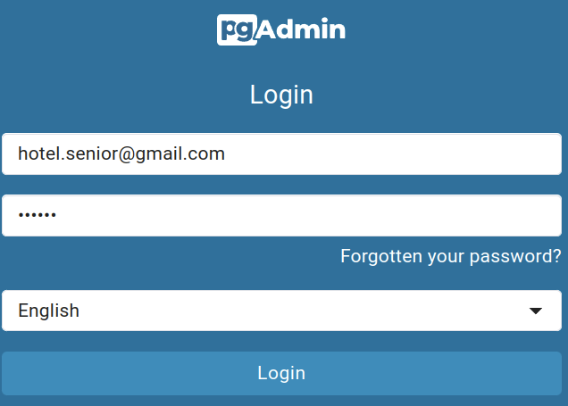
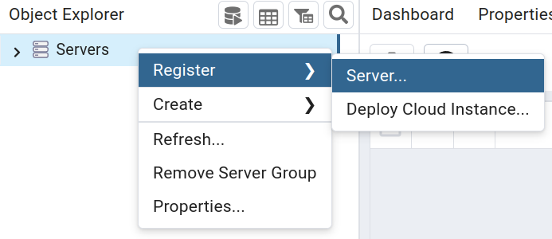
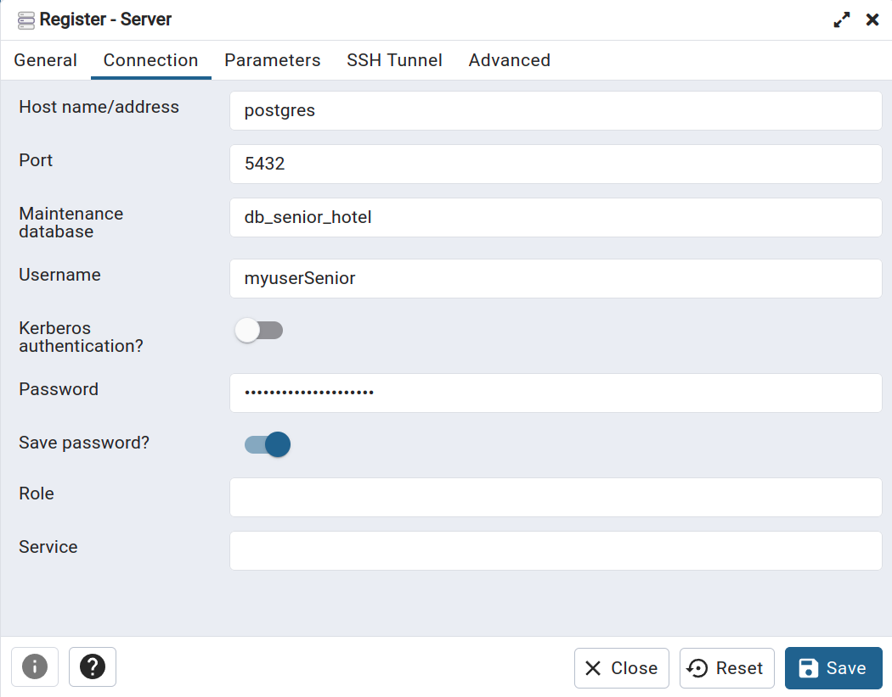
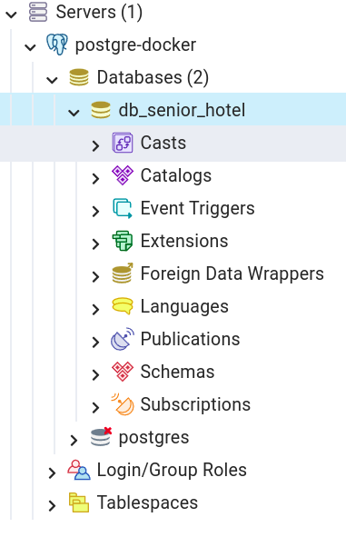
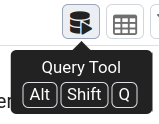
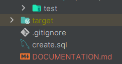
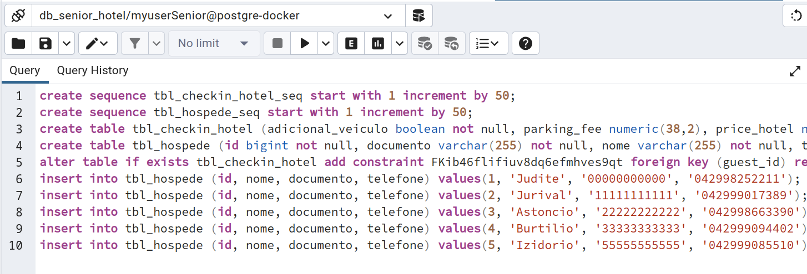
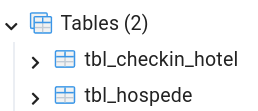
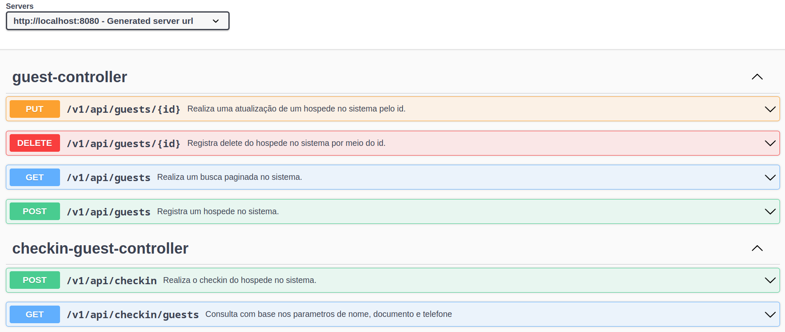

# Guia para o desafio tecnico da empresa Senior.

### Documentação de referência

### Objetivo
Desenvolver uma aplicação (Somente o backend) que possibilite realizar o cadastro de
hóspedes e o check in.
Queremos ver como você resolve problemas no seu dia-a-dia. Não há necessidade de
desenvolver o frontend da aplicação, vamos utilizar o Postman para testar sua aplicação.

### Requisitos funcionais
- Um CRUDL para o cadastro de hóspedes;
- No check in deve ser possível buscar hóspedes cadastrados pelo nome, documento
ou telefone;
- Consultar hóspedes que já realizaram o check in e não estão mais no hotel;
- Consultar hóspedes que ainda estão no hotel;
- As consultas devem apresentar o valor (Valor total e o valor da última hospedagem)
já gasto pelo hóspede no hotel;
---------
### JSON exemplo do hóspede
{
 “nome”: “Fulano da SIlva”,
 “documento”: “123456”,
 “telefone”: “9925-2211”
}
### JSON exemplo do check in
`{`
“hospede”: {...},
“dataEntrada”: “2018-03-14T08:00:00”,
“dataSaida”: “2018-03-16T10:17:00”,
“adicionalVeiculo”: false/true
`}`
--------------
`data no padrão ISO-8601`
  ### Regras de negócio
  - Uma diária no hotel de segunda à sexta custa R$120,00;
  - Uma diária no hotel em finais de semana custa R$150,00;
  - Caso a pessoa precise de uma vaga na garagem do hotel há um acréscimo diário,
  sendo R$15,00 de segunda à sexta e R$20,00 nos finais de semana;
  - Caso o horário da saída seja após às 16:30h deve ser cobrada uma diária extra;

### Guides
Para acessar o projeto acesse este link e realize o clone em sua máquina:

* [Projeto hotel senior](https://github.com/LucasDev13/hotel-senior)

### Passo a passo para criar o banco de dados.
- Clonar o projeto
- Rodar o docker compose que esta dentro da pasta de resource para poder subir os containers do postgres
e do pgadmin: `$ docker compose up -d`
- Para acessar o pgAdmin é por esta url http://localhost:16543/browser/
- O usuario e senho de acesso são:
  - email: hotel.senior@gmail.com
  - senha: senior
    * 
  
- Crie um novo sever
  * 
- E insira as informações do postgres definidos no arquivo docker-compose e salve.
  * 

- O banco de dados aparecerá desta maneira:
  * 
- Acesso a aba de Query Tool para criamos as tabelas.
  * 
- Insira o script salvo no arquivo `create.sql` que está dentro do projeto .
  * 
  * 

- Desta maneira as tabelas serão criadas.
  * 

### Passo a passo para utilizar as requisições do projeto.
- ### Swagger da api
http://localhost:8080/swagger-ui.html

* Requisições que foram criadas:
  * 

### Json para requisições e suas uri:
- Cadastro de hospedes:
  * http://localhost:8080/v1/api/guests
  * `POST`
    ```
    {
        "nome": "Mariana",
        "documento": "03698106000",
        "telefone": "042999098571"
    }
    ```
- Listar hospedes paginado, podendo trazer todos os hospedes:
  *  http://localhost:8080/v1/api/guests
  * `GET`

- Atualizar hospedes por id:
  * http://localhost:8080/v1/api/guests/1
  * `PUT`
  ```
  {
    "nome": "novo nome do hospede",
    "documento": "99999999999",
    "telefone": "032999046660"
  }
  ```
- Deletar hospedes:
  * `DELETE`
  * http://localhost:8080/v1/api/guests/1

- Fazer checkin:
  * http://localhost:8080/v1/api/checkin
  * `POST`
  ```
    {
    "hospede":{
    "nome": "Izidorio",
    "documento": "55555555555",
    "telefone": "042999085510"
    },
    "dataEntrada": "2023-10-20T08:00:00",
    "dataSaida": "2023-10-26T10:17:00",
    "adicionalVeiculo": "true"
    }
  ```
- Listar hospedes por parametros:
  * http://localhost:8080/v1/api/guests?param=03698106000
  * `GET`
  * Param recebe o nome, documento ou telefone 